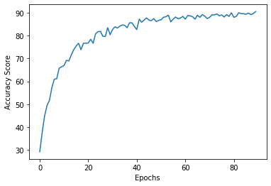

### Uma.Tech Challenge
_Rinat Babichev  
Innopolis University BS3-DS student_  

### Task
Create bot which classifies images of football players by their classes 
**Example**:  
A20 & A15 classes   

### Solution
**Bot Address - @Uma_Tech_Bot**
1) **Data Pre-processing** : is simple,  I
just resized  all images to the average width and height
2) **Model** : as a Machine Learning base model I 
used CNN, as they are fit good for image classification. 
After many experiments I came to the following network architecture:
    * Two Convolution layers with 3/32 Input and 32/64 Output channels, filter size 5
    * Four Fully Connected layers with 8704/500/250/100 Input and 500/250/100/25 Output Channels
    * Activation Function - relu  
    * SGD with 0.001 learning rate was used as an optimizer  
3) **Training** : Data from Image Folder was split on train-test sets
with 80:20 proportion, loaded into Torch DataLoaders and trained  using above network
with 100 epochs and 32 batch size
4) **Results**:  
Best score on test(unseen) data was `90.4%`  
Plot of error over epochs:

### Code
1) **Used libraries**:
    * numpy
    * matplotlib
    * opencv-python 
    * scikit-learn
    * torch
    * torchvision
    * python-telegram-bot
2) **Code** - in the beginning of the program it either trains new model  
or loads existing weights/biases from file and after initiating model it runs  
tg-bot
(I uploaded pre-calculated model to file *src/footballers.pt*)
3) **Running Code**:
    * Add **your**  bot token to file `src/constant`
    * Using Docker:  
        1. `cd src`
        1. `docker build . tag==clf_bot`
        2. `docker run clf_bot`
    * Without Docker:
        1. `cd src`
        2. `pip3 install -r requirements.txt`
        3. `python3 main.py`
       